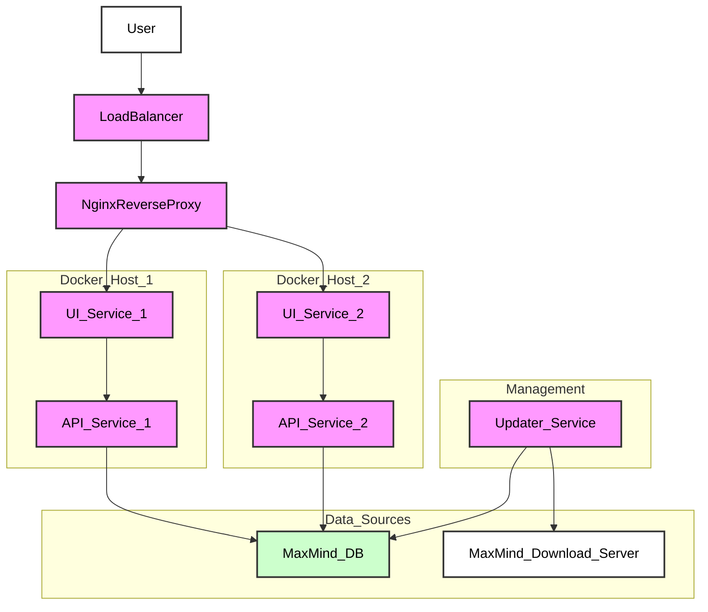

[< Back to README](../README.md)

# Production Deployment

Deploying `ip-info` in a production environment requires careful consideration of security, scalability, and reliability. This guide provides recommendations for a robust production setup.

## Security Best Practices

*   **Firewall**: Restrict access to the API and UI ports (e.g., 80/443) to only necessary sources.
*   **HTTPS**: Always use HTTPS for all communication. Configure a reverse proxy (e.g., Nginx, Caddy) to handle SSL termination.
*   **Environment Variables**: Do not hardcode sensitive information (like MaxMind license keys) directly in configuration files. Use environment variables or a secrets management system.
*   **Least Privilege**: Run containers with the minimum necessary privileges.
*   **Regular Updates**: Keep your Docker images, host OS, and dependencies updated to patch security vulnerabilities.

## Scalability and High Availability

*   **Container Orchestration**: Use Docker Swarm, Kubernetes, or similar tools to manage and scale your containers. This allows for easy scaling of API and UI services based on demand.
*   **Load Balancing**: Distribute incoming traffic across multiple instances of your API and UI services using a load balancer.
*   **Persistent Storage**: If you plan to store any persistent data (e.g., custom configurations or logs), ensure it's on a persistent volume that can be shared or replicated across instances.

## Monitoring and Logging

*   **Centralized Logging**: Implement a centralized logging solution (e.g., ELK stack, Grafana Loki) to collect logs from all containers. This helps in debugging and monitoring the application's health.
*   **Monitoring Tools**: Use tools like Prometheus and Grafana to monitor container health, resource utilization, and application-specific metrics.
*   **Alerting**: Set up alerts for critical events, such as service downtime, high error rates, or resource exhaustion.

## Backup Strategy

*   **MaxMind Databases**: While these can be re-downloaded, ensure your `updater` service is reliable. Consider backing up the downloaded databases if network access is a concern.
*   **Configuration Files**: Back up your `docker-compose.yml`, `.env` file, and any other critical configuration files.

## Example Production Setup (Conceptual)

This diagram illustrates a highly available setup with multiple UI and API service instances behind a load balancer and reverse proxy. The updater service ensures the MaxMind database is kept current.